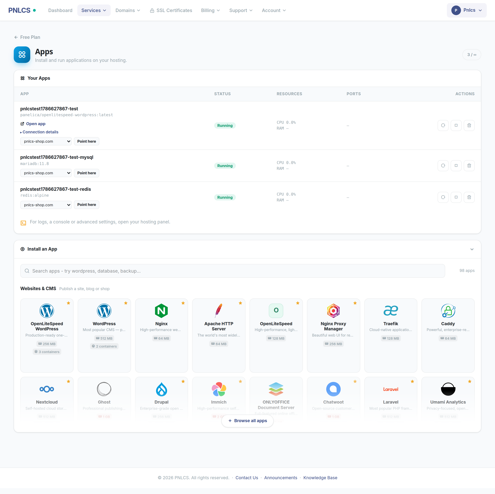
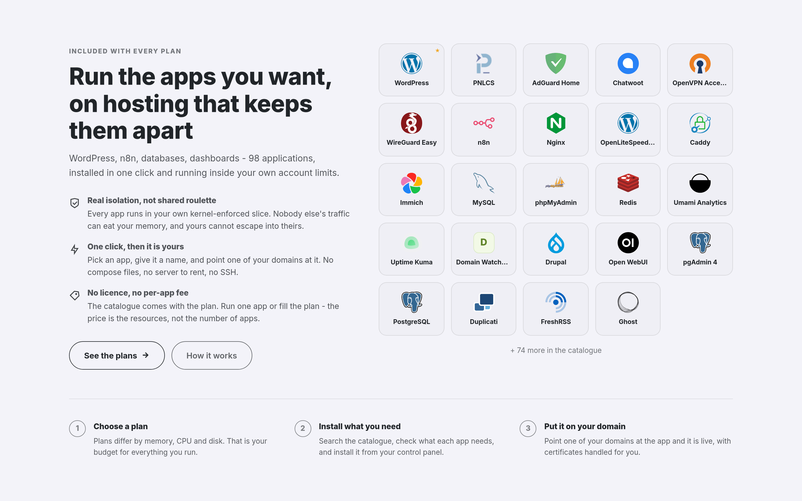

# Sell Docker Apps

PNLCS can sell one-click applications — WordPress, n8n, databases, remote
desktops — that run as Docker containers inside a customer's hosting account on
a connected Panelica server.

This guide covers the whole path: where the resources come from, how to build
the products, what the customer sees, and how to keep the catalogue honest.

## What the customer is actually buying

**Not a separate Docker product.** Apps run inside the hosting account the
customer already has, using that account's own resources:

```
Product  →  Panelica plan  →  hosting account  →  cgroup slice
                                                       │
                                    every app runs inside this slice
```

The plan decides three things that matter for apps:

| Plan field | What it controls |
|---|---|
| **Max Containers** | How many apps the customer may install (`0` = apps off) |
| **Memory limit** | The **total** memory for all their apps together |
| **CPU limit** | The **total** CPU for all their apps together |

A customer on a 2 GB plan running three apps has 2 GB across all three — not
2 GB each. This is enforced by the kernel, not by us: the account gets a cgroup
slice with `memory.max` set, and every container the customer starts is created
inside it. One tenant cannot eat another tenant's memory, and cannot exceed
what they bought.

!!! note "Why this matters commercially"
    Most competing setups run customer containers with Docker-in-Docker or in
    privileged mode, which means a tenant can escape their limits. Panelica does
    not: the External API refuses privileged containers, extra capabilities and
    host-path mounts even when the billing key authenticates as an operator.
    You can sell shared Docker hosting without giving anyone the host.

## 1. Connect a Panelica server

**Configuration → Servers → Add Server**, type **Panelica**. See
[Connect a Server](connect-a-server.md).

The server's API key must carry the `docker:*` scopes. Without them the
catalogue is empty and nothing can be installed.

## 2. Decide how you want to sell

There are three shapes. You can offer all three at once.

### a) Ordinary hosting, apps included

A normal hosting product with **Max Containers** set to 1 or more. The customer
buys hosting, gets a website, and can also install apps from the **Apps** tab in
their service page whenever they like.

This is the easiest one to start with — an upsell on plans you already sell.

### b) App Hosting — the order installs one app

The product sells one app. On provisioning, PNLCS creates the account and the
domain, installs the app, and points the domain at it, so the customer's site
is live on their own address the moment the order completes.

Two variants:

- **Fixed app** — the product always installs the same app (a "Managed
  WordPress" plan, say). Set **App Hosting** on the product to the app you want.
- **Customer picks the app** — one product, any app in your catalogue. The
  order form shows the app grid and the customer chooses. Tick **Customer picks
  the app**.

The second one is what makes this scale: you do not need 98 products to sell 98
apps.

!!! warning "The order is all-or-nothing"
    If the app cannot be installed, the account is rolled back and the order
    fails. A customer who paid for "Managed WordPress" should not be handed an
    empty account with an apology — so nothing half-built is left behind.

### c) Container Plan — resources without a website

A product that sells container resources and no website. It provisions without
asking for a domain, and the customer's service page shows only the **Apps**
tab. Tick **Container plan** on the product.

Use this for "run your own stack" plans where a domain would be meaningless.

## 3. Build the product

**Products → Create Product**, then set:

1. **Server Type** → `panelica`
2. **Panelica Resources** section:
    - **Max Containers** — at least `1`, or apps stay off
    - **RAM (MB)** and **CPU Limit (%)** — the ceiling all their apps share
    - **Disk (MB)** — app data lives in the customer's home directory and counts
      against this
3. One of:
    - **App Hosting** → pick an app (fixed-app product)
    - **Customer picks the app** → tick it (catalogue on the order form)
    - **Container plan** → tick it (no domain)
4. Pricing, as with any other product

!!! tip "Sizing the plan"
    Look at what the apps you intend to sell actually need. The app cards in the
    catalogue state a memory figure and how many containers the app starts. A
    plan of 1 GB cannot run an app whose own floor is 2 GB, and the customer will
    be told so before they order — but it is better to size the plan properly
    than to sell one that only fits the small apps.

## 4. Curate the catalogue

**Products → App Catalogue**

The Panelica server decides *what exists* — which apps, which plans may install
them, whether an app is active. This screen decides *how you sell them*:

| Control | Effect |
|---|---|
| **Offered** | Untick to keep an app out of your shop entirely |
| **Featured** | Leads the grid, marked with a star |
| **Order** | Your own ordering; higher comes first |
| **Tagline** | One selling line under the name, instead of the panel's description |
| **Logo** | Upload one, or fetch from a URL — see below |

### Logos

Logos come from three places, and the first one that has an answer wins:

1. **What you uploaded** — stored under `storage/app/public/docker-apps`
2. **What ships with PNLCS** — committed to `public/img/apps`, listed in
   `manifest.json`
3. **A coloured letter tile** — drawn from the slug, always available

Layer 2 is why a fresh install looks finished straight away: 95 of the panel's
98 apps have a logo out of the box, with no fetching and no configuration. The
three without one (`memcached`, `openlitespeed`, `domain-watchdog`) publish no
usable logo file, and a wrong logo is worse than a letter tile.

!!! note "Why not the panel's own logo_url"
    The panel's catalogue links to logos on other people's servers. Measured on
    a live catalogue: only 13 of 98 links still resolved, 11 were dead and
    rendered as broken images, and the rest had none - so the grid looked
    half-finished and every customer page load called out to GitHub and jsDelivr.
    PNLCS serves logos from its own storage instead.

**To change a logo**, use *Products → App Catalogue*: upload a file, or paste a
URL to fetch from. That writes into layer 1, which wins over the shipped set and
survives updates.

**To fill in logos for apps added later**, either press *Fetch missing logos* on
that screen or run:

```bash
php artisan docker-apps:import-logos             # only apps with no logo
php artisan docker-apps:import-logos --overwrite # refetch everything
php artisan docker-apps:import-logos --no-icon-set  # only the panel's links
```

It tries the panel's link first and a public icon set second, and reports what
it could not fetch. It never touches the logos committed to the repository.



## 5. Put it in the shop window

**Configuration → Homepage** → enable the **One-Click Apps** section.

It shows what a visitor can install, ordered the same way the order form orders
it — featured first, then your order, then how often each app has actually been
installed. The heading, subheading, button, the three selling points and how
many apps to show are all editable there.



The section ships **disabled**, and reading the catalogue only happens when it
is switched on, so an install with no Panelica server attached does not
advertise apps or pay for the lookup.

## What the customer sees

**Service page → Apps**

- The catalogue, searchable, arranged in sections (Websites, Databases, AI,
  Developer Tools, …) with a line saying what each section is for
- Each card: the memory the app needs, how many containers it starts, and a
  clear mark when it needs more memory than their plan allows
- **Install** on the card itself; the install box opens right underneath it,
  and the button says *Installing…* while images download
- Their running apps, with **Start / Stop / Restart / Remove**
- **A domain picker under each running app** — pick one of the account's own
  domains and press *Point here*, and the app is served on it; the domain shows
  as a link, and an × hands it back to ordinary web hosting
- An app stuck in a restart loop reads **Not starting**, with a line saying what
  that usually means
- A counter showing how many of their allowance they have used

Apps a customer installs are fenced to their own account: the billing key is
operator-scoped and can see every container on the server, so PNLCS filters by
the account's ownership label on every list and every action. A customer cannot
see, stop or delete anybody else's app.

## Reading the resource figures honestly

Two numbers on each card, and it is worth knowing exactly what they mean.

**The memory figure is the main container's floor.** If the customer's plan
gives less, the panel raises it to this floor rather than starting a container
that will be starved. It is not the app's total appetite.

**The container count is the rest of the story.** Twenty apps in the catalogue
start more than one container — Immich runs a server, a Postgres, a Redis and a
machine-learning worker. Those helpers have no memory limit of their own; they
run in the same account slice and draw on the same allowance. So an app marked
*2 GB · 4 containers* needs rather more than 2 GB in total.

!!! danger "Check the figures for the apps you sell"
    These floors are catalogue data and some of them have been wrong. Immich was
    listed at 2 GB when its own documentation asks for
    [6 GB minimum, 8 GB recommended](https://docs.immich.app/install/requirements/)
    — a customer on a 2 GB plan could order it and watch it die. Before you
    feature an app, read its upstream requirements and make sure your plan
    covers them, helpers included.

## What to tell customers

The knowledge base ships with six articles under **Apps & Docker**, written for
the customer rather than the operator:

- What am I buying: hosting or an app?
- Installing an app
- Putting an app on your own domain
- My app says "Not starting"
- How many apps can I run?
- Removing an app

They are ordinary knowledge base entries, so edit them under **Support →
Knowledge Base** to match your own wording, plans or support policy.

## Troubleshooting

**The catalogue is empty**
: The server is not reachable, its API key lacks `docker:*`, or the customer's
  plan has `Max Containers = 0`.

**An app installs and then stops**
: Almost always memory. Check the app's real requirements against the plan,
  remembering the helper containers.

**"Needs more memory than your plan"**
: Working as intended — the card is comparing the app's floor against the plan
  ceiling before the customer commits.

**The order failed and the account is gone**
: An App Hosting order rolls back when the app cannot be installed. The reason
  is in the service's module log.

**A customer's second order fails**
: The panel keeps one account per email address. PNLCS retries once with a
  tagged address (`buyer+pnlcs7@example.com`), which reaches the same inbox, so
  a customer can hold more than one plan.

**Installing a large app returns an error but the app appears anyway**
: Installing pulls container images and can take minutes. The call waits five
  minutes; past that the customer is told it is still running rather than shown
  an error page.
